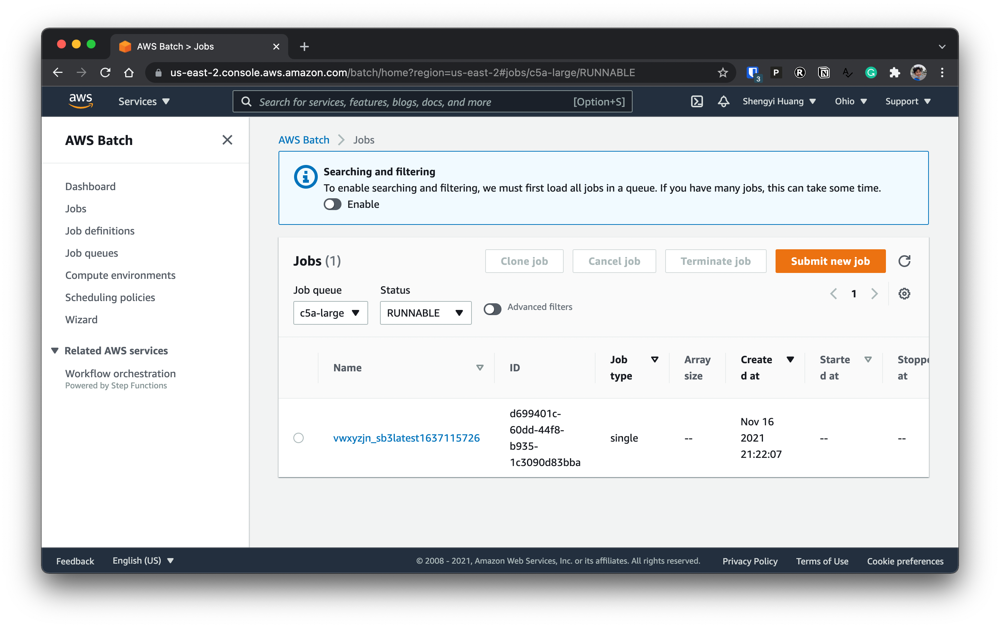

# launcha-sb3-example

```
pip install launcha
launcha init
```

```
terraform init
terraform apply
```

```
launcha -d vwxyzjn/sb3:latest --build --push --command "python sb3_example.py"
docker pull vwxyzjn/sb3:latest
docker run -d -e WANDB_API_KEY=xxxxxxxxxxxxxxxxxxxxxxxxxxxxxxxxxxxxxxxxx vwxyzjn/sb3:latest /bin/bash -c "python sb3_example.py"
```
[](https://asciinema.org/a/LAnbPd3Vv6qUJHoaKTGZUdp82)

### Submitting experiments to the cloud

```
launcha -d vwxyzjn/sb3:latest --build --push \
    --command "python sb3_example.py" \
    --job-queue c5a-large \
    --num-vcpu 1 \
    --num-memory 2000 \
    --num-hours 48.0 \
    --provider aws
```




